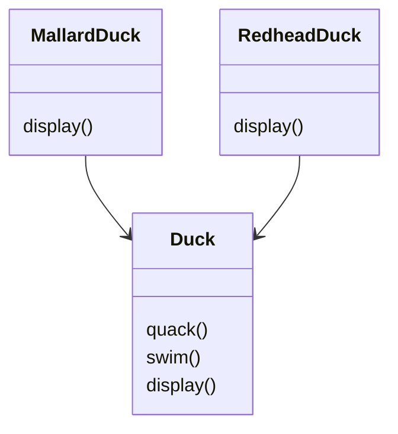
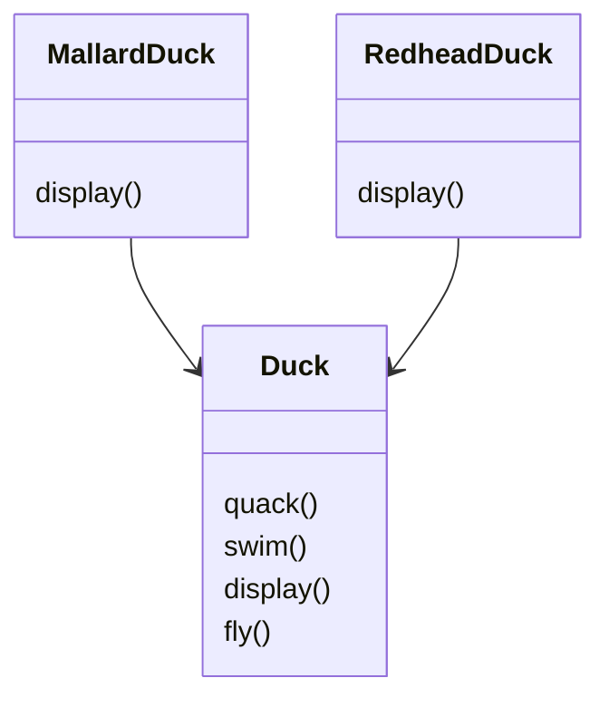
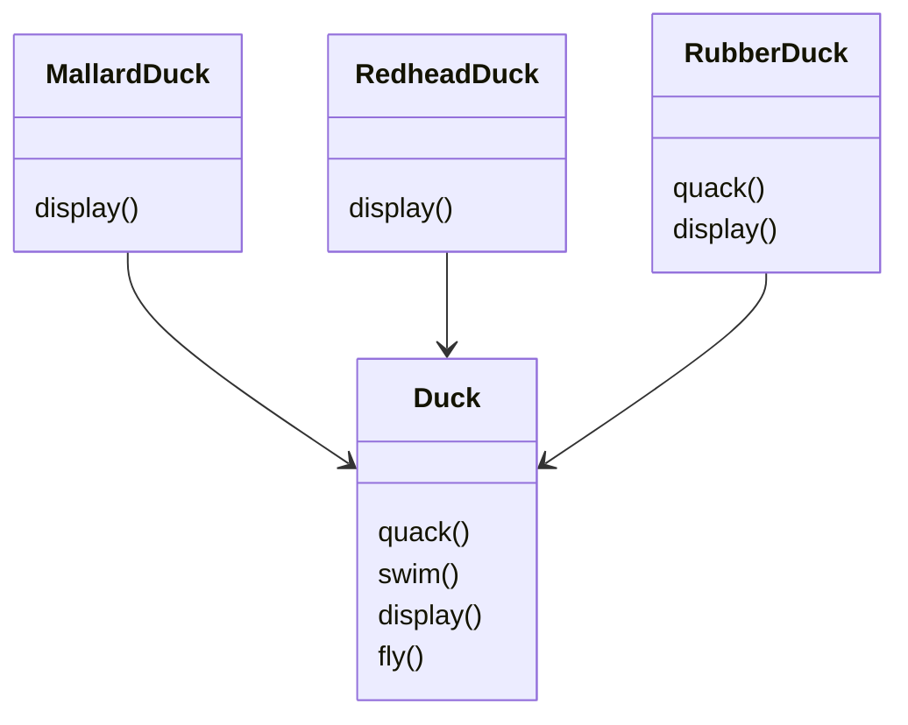
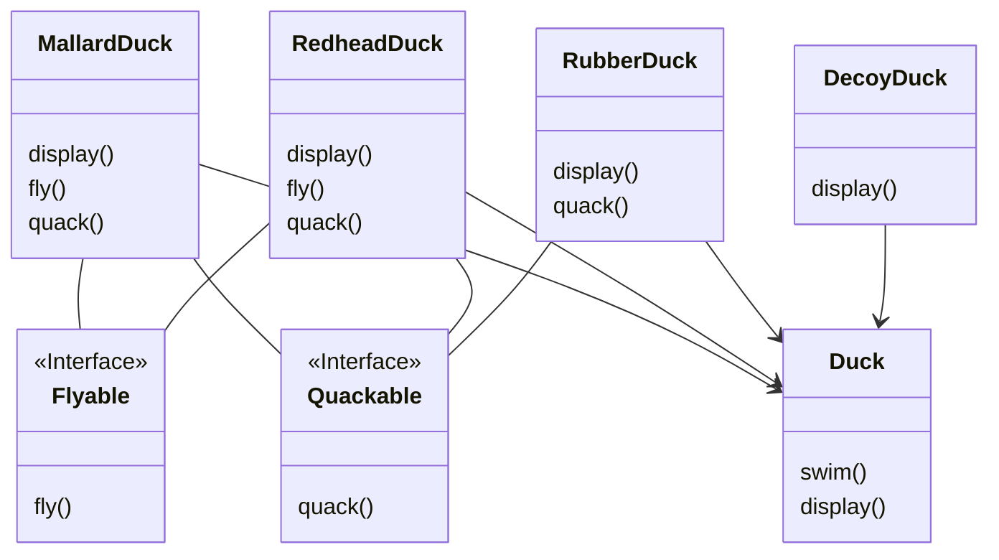

# Chapter 1

## 디자인 패턴 소개와 전략 패턴

### `SimUDuck`

오리 시뮬레이션 게임 `SimUDuck`은 표준 객체지향 기법을 사용하여 Duck 이라는 슈퍼클래스를 생성하고, 그 클래스를 확장하여 다른 종류의 오리를 만들었다.



---

### `SimUDuck`의 차별화

게임의 차별화를 위해 아래와 같이 fly() 메소드를 추가하였다.



```txt
문제상황
* Duck을 상속받은 몇개의 서브클래스만 fly() 메소드를 추가해야 함

-> 코드를 재사용한다는 점에서 상속을 사용하였지만 유지보수 측면에서 다른 방안을 생각해야 한다.
```



```txt
RubberDuck은 다른 소리를 내므로 quack()을 오버라이드 하여 다른 소리를 내도록 수정하였다. 마찬가지로 fly()도 오버라이드 하여 아무 동작도 하지 않도록 하면 되는 것 아닌가?

* 나무로 된 가짜 오리가 추가된다면?
-> 소리도 안내고, 날 수도 없고, 아무 동작도 안하기 때문에 3가지 메소드를 오버라이드 해야 한다.
```

---

### `인터페이스` 설계하기

상속은 올바른 선택지가 아니라 판단하여 인터페이스를 적용해 보았다.



```txt
* 코드가 중복되는 문제
-> fly() 메소드를 수정하기 위해 수십개의 코드를 전부 고쳐야 할 수도 있다.
```

---

### 해결 방법

> 아무리 디자인을 잘한 어플리케이션이라 해도 시간이 지남에 따라 변화하고 성장해야 한다. 이것은 절대로 바뀌지 않는 진리이다.

`문제를 명확하게 파악하기`

```txt
* 상속의 문제점
-> 오리의 행동이 바뀔 수 있음에도 모든 서브 클래스에서 한 가지 행동만 사용하도록 함

* 인터페이스의 문제점
-> 자바 인터페이스에는 구현된 코드가 없으므로 코드를 재사용 할 수 없음
-> 메소드 수정마다 정의되어 있는 서브클래스를 모두 찾아서 코드를 고쳐야 함
```

해결방법

```txt
디자인 원칙 1
"애플리케이션에서 달라지는 부분을 찾아내고 달라지지 않는 부분과 분리한다."
"나머지 코드에 영향을 주지 않도록 캡슐화 한다."
```

>이 해결방법은 매우 간단하지만 다른 모든 디자인 패턴의 기반을 이루는 원칙이다. 모든 패턴은 시스템의 일부분을 다른 부분과 독립적으로 변화시킬 수 있는 방법을 제공한다.

`변화하는 부분 분리하기`

```txt
fly()와 quack() 문제를 제외하면 Duck 클래스는 잘 동작하고 있고 나머지 부분은 자주 변경되지 않거나 그대로 유지된다. 그러므로 Duck 클래스는 그대로 두도록 한다.

* fly()와 quack()은 Duck 클래스에 있는 오리의 종류에 따라 변화함
* fly()와 quack()은 Duck 클래스로 부터 분리해야함
-> 각 행동을 나타낼 클래스 집합을 새로 만들어야 한다.
```

`오리의 행동 디자인하기`

```txt
* 오리의 행동에 유연성을 주어야함
* 오리 인스턴스에 행동을 할당
* 새로운 오리 인스턴스를 만들고 특정 형식의 나는 행동으로 초기화
* 오리의 행동을 동적으로 바꿀 수 있도록함
```

```txt
디자인 원칙 2
"구현보다는 인터페이스에 맞춰 프로그래밍 한다."
```

각 행동은 인터페이스로 표현하고 인터페이스를 사용하여 행동을 구현한다. 이제 fly()와 quack()은 Duck 클래스에서 구현하지 않는다.
